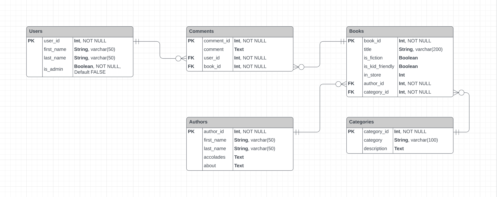

# Book Store API Web Application Project

## Index  
- [R1 - Identification of the problem you are trying to solve by building this particular app](#r1---identification-of-the-problem-you-are-trying-to-solve-by-building-this-particular-app)  
- [R2 - Why is it a problem that needs solving](#r2-–-why-is-it-a-problem-that-needs-solving)  
- [R3 - Why have you chosen this database system. What are the drawbacks compared to others?](#r3---why-have-you-chosen-this-database-system-what-are-the-drawbacks-compared-to-others)  
- [R4 - Identify and discuss the key functionalities and benefits of an ORM](#r4---identify-and-discuss-the-key-functionalities-and-benefits-of-an-orm)  
- [R6 - Make an ERD for the app](#r6---make-an-erd-for-the-app)  
- [R8 - Discuss the database relations to be implemented in your application](#r8---discuss-the-database-relations-to-be-implemented-in-your-application)

## R1 - Identification of the problem you are trying to solve by building this particular app.

A book store requires a inventory system that will allow employees to easily find books within the stores inventory, using several methods to find the correct book for a customer. The employees will be able to search for a books availability by simply searching for it’s title, but they will also be able to look up any available books by using other criteria such as author or style (crime, fantasy, romance, etc..). Having these extra search methods will allow employees to suggest appropriate books to customers based on their interests. An internal review system, by way of comments assigned to books, will allow employees to gain a quick understanding of a book so they can explain a title to a customer, without having read the book, as it would be nearly impossible to read all of the books in the store. The internal review system is based off similar systems like tasting notes in a wine store or product reviews in an appliance store. The inventory system will assign employees logins and passwords that will have certain privileges associated, such as creating a new book entry, and adding new reviews. Managers will get administrator credentials that will give them more extensive privileges such as deleting book entries and reviews, as well as altering the inventory numbers, along with the same privileges that the employees have. All inventory users will be able to use all the search functions. 

## R2 – Why is it a problem that needs solving?

The inventory system is needed to help employees save time when serving customers in many different ways. Employees will be able to quickly find specific books when customers inquire if it is in stock, and if it is not in stock, they will be able to quickly recommend similar books to the customer, based on other titles by the same author, or similar books in the same style. Employees will also be able to give customers a quick overview of a book from the internal review system. This will not only reduce the work load on the employees, it will also add to the customer experience, without needing the employee to read and memorise all of the titles within the store. Managers tasks will be made easier as they will be able to check inventory levels along with being able to disseminating talking points throughout the staff that they would like to emphasise on certain titles to increase sales using the review system.  

## R3 -  Why have you chosen this database system. What are the drawbacks compared to others?

I have chosen to use PostgreSQL as my database system for several reason which I will go into. To begin with, PostgreSQL an advanced, fully open sourced SQL database system, unlike Oracle, SQL Server and even MySQL which have fee which can get very expensive. Though MySQL is still technically an open sourced database system, they were partially bought by Oracle and since then certain features and services have been hidden away behind a paywall. MySQL it is still a very capable database system in it’s free, open sourced version, it is not quite as ‘free’ as PostgreSQL depending on your circumstance. Oracle can get very expensive if you decide to really scale up, as Amazon found out when they started to grow into one of the worlds largest companies. The cost had become so high that Amazon eventually switched their systems over to PostgreSQL. Some other tech giants that utilise PostgreSQL are Apple and Cisco, and I can imagine the cost might have a big part to play in their decisions. 

PostgreSQL will work on pretty much any machine or operating system, while systems like SQL Server will only run on Microsoft or Linux software. PostgreSQL mainly relies on it’s community for support as it is an open source software system, but this is not an issue as it has been around for over 20 years and the community is very large and active. PostgreSQL scales easily and is highly customisable as it has access to a near endless amount of plugin libraries, such as psycopg2 for python, which we will be using for our web application. 

From a more technical view, PostgreSQL uses Multiversion Concurrency Control (MVCC) which allows parallelisation so your queries can use multiple cores on the machine that is hosting your database, increasing power and speeding up query time. MySQL as PostgreSQL’s main open source competitor does not have this. PostgreSQL is able to use almost any data type and any index which gives it a huge amount of flexibility. Postgresql is more SQL complainant than MySQL, so in a strange turn of events if you ever wanted to take your project into a closed source environment like Oracle, PostgreSQL would make the transition better than MySQL, which is partially owned by Oracle. Lastly, PostgreSQL is very popular for web applications exactly like what we intend to make in this project, so it is perfect for us. 

## R4 - Identify and discuss the key functionalities and benefits of an ORM

An ORM (Object Relational Mapping) tool is used to map relational databases to objects in you preferred object-oriented programming language. There are many ORMs for many programming languages but the core functionalities are all basically the same. The main function of an ORM is that it abstracts SQL into objects of the language you are working in. This allows us to use objects from a certain language instead of needing to rely on direct SQL query statements. An ORM will all so parse the results that are returned from the query and give them back to us. This helps to improves readability, as direct SQL can be very dense and hard to decipher. This can also help reduce errors and speeds up production as it reduces the amount of code you have to work with. This will usually mean decreased costs associated with the development of an application. 

ORMs can make accessing data much easier. They map out how certain objects will relate to different tables within your database, then use these relationships to create SQL queries such as the basic CRUD operations, Create (or Insert), Read, Update and Delete. These terms may differ between languages and databases, but they all perform the same basic tasks needed to use your database. Of course an ORM tool will allow for much, much more complex SQL queries, but will still keep them fairly concise and readable for the development team. 

Another very important and welcome feature of an ORM is that it increases your databases security, reducing the possibility of SQL injection threats. This is because of the layer of abstraction an ORM gives a database, forcing outside queries through the ORM before it can make it to the database itself. Of course, this is not perfect and ORM injection can happen. 

Some issues with ORMs are that it can slow down the execution of queries compared to using SQL directly, as the ORM will usually produce a lot of it’s own code along side the minimum SQL needed. Another issue is ORMs themselves must be learned and implemented, which can be difficult and time consuming. The latter argument is usually overshadowed by the overall increase in productivity once an ORM is learned and implemented, and the former will depend on the projects needs and there are cases where this will be negligible or even non existent. Finally, a last issue that can effect a project is an ORM can be limiting, and you may need to resort to using direct SQL at some point. Many ORMs offer this feature though, but not all. 

## R6 - Make an ERD for the app
This is my ERD for my Book Store application. 

## R8 - Discuss the database relations to be implemented in your application

My book store database will be tracking several entities which I will describe here. It will have a ‘Users’ table, which will contain attributes such as the table’s Primary Key, the unique User ID (Integer, NOT NULL), the users first name (String, varchar(50)), last name (String, varchar(50)) and whether the user has Admin access or not (Boolean, NOT NULL, Default FALSE). 

The second table will be ‘Books’, with attributes such as the table’s Primary Key, the unique Book ID (Integer, NOT NULL), the books title (String, varchar(200)), if it is fiction (Boolean), if it is kid friendly (Boolean) and the number of copies in store (Integer). The ‘Books’ table will also have two Foreign Keys, an Author ID (Integer, NOT NULL), which will connect to a table called ‘Authors’ with a one and only one on the authors side to an optional many on the books side, and a Category ID (Integer, NOT NULL), which will connect to a table called ‘Categories’ with a one and only one on the categories side to an optional many on the books side. 

The ‘Authors’ table will contain the attributes about the author, such as the table’s Primary Key, the unique Author ID (Integer, NOT NULL), the author’s first name (String, varchar(50)), last name (String, varchar(50)), any accolades they may have garnered (Text) and a short description called ‘about’ (Text). 

The ‘Categories’ table will contain attributes such as the table’s Primary Key, the unique Category ID (Integer, NOT NULL), the category itself (String, varchar(100)) and a short description about the category called ‘description’ (Text). 

The final table is a joining table between the ‘Books’ table and the ‘Users’ table, called ‘Comments’. The ‘Comments’ table will contain attributes such as the table’s Primary Key, the unique Comment ID (Integer, NOT NULL), the comment itself (Text), and two foreign keys, the User ID (Integer, NOT NULL) of the user that has created the comment, and the Book ID (Integer, NOT NULL) of the book the comment is about. The ‘Comments’ table will connect to the ‘Users’ table with a one and only one on the users side to an optional many on the comments side, and it will connect to the ‘Books’ table with a one and only one on the books side to an optional many on the comments side.  

## R10 - Describe the way tasks are allocated and tracked in your project

Link to my Trello Board used for this project:  
[API Project Trello Board](https://trello.com/b/muUAZRzW/api-assignment)